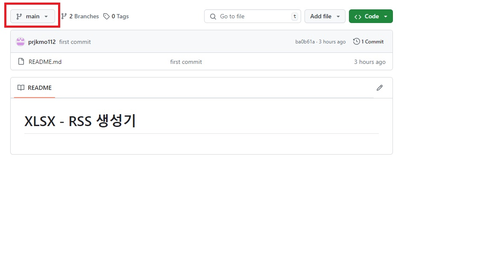

# XLSX - RSS 생성기

[xlsx 업로드 방법](#xlsx-업로드-방법)
[업로드 엑셀 양식](#업로드-엑셀-양식)

## XLSX 업로드 방법
> **엑셀에 암호를 걸어두어야 안전합니다**

1. 엑셀 업로드
- https://github.com/lohas-org/xlsx2rss/tree/main 접속
- **브랜치가 manager에 놓여져있는지 확인**

- **files 폴더 클릭**
- Add file -> <svg aria-hidden="true" focusable="false" role="img" class="octicon octicon-upload" viewBox="0 0 16 16" width="16" height="16" fill="currentColor" style="display: inline-block; user-select: none; vertical-align: text-bottom; overflow: visible;"><path d="M2.75 14A1.75 1.75 0 0 1 1 12.25v-2.5a.75.75 0 0 1 1.5 0v2.5c0 .138.112.25.25.25h10.5a.25.25 0 0 0 .25-.25v-2.5a.75.75 0 0 1 1.5 0v2.5A1.75 1.75 0 0 1 13.25 14Z"></path><path d="M11.78 4.72a.749.749 0 1 1-1.06 1.06L8.75 3.811V9.5a.75.75 0 0 1-1.5 0V3.811L5.28 5.78a.749.749 0 1 1-1.06-1.06l3.25-3.25a.749.749 0 0 1 1.06 0l3.25 3.25Z"></path></svg> Upload files 클릭

- 파일 선택, 커밋 메시지 작성
- **`Commit directly to the main branch.` 선택**
- **Commit changes 클릭**

## 업로드 엑셀 양식